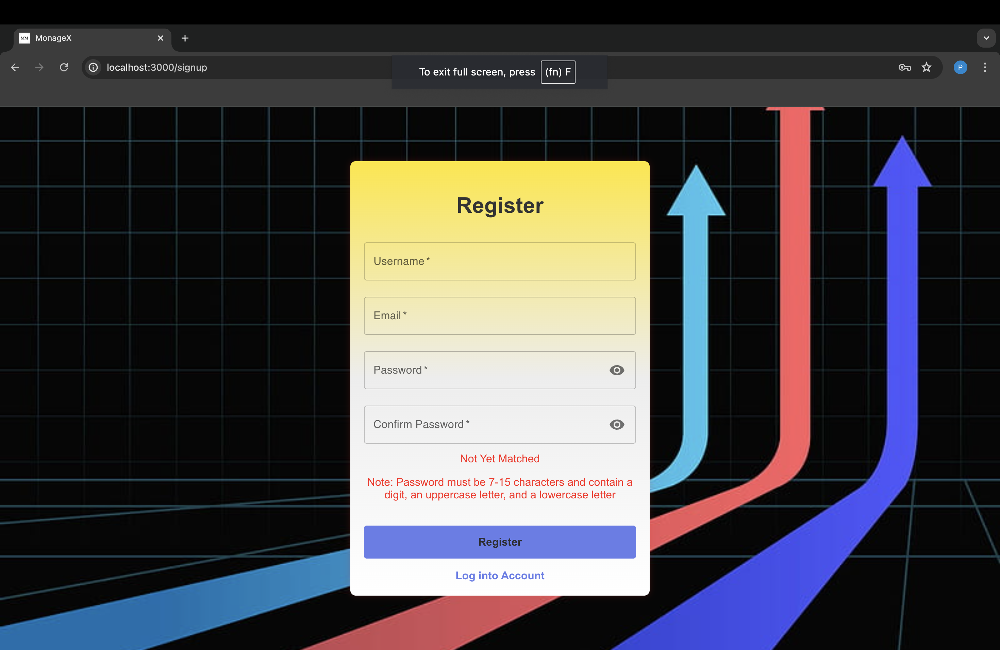
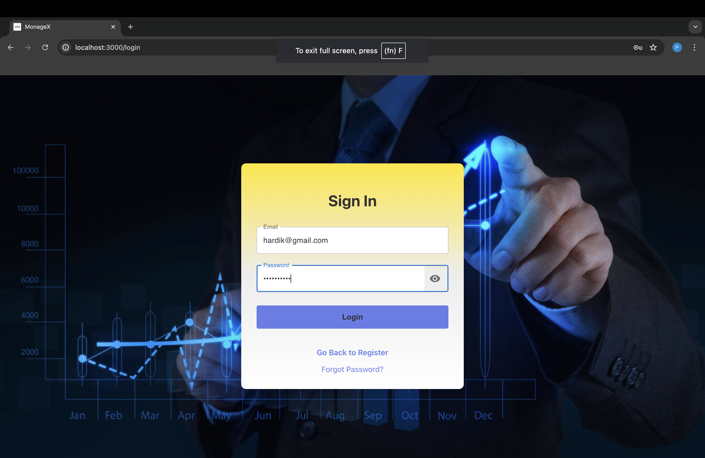
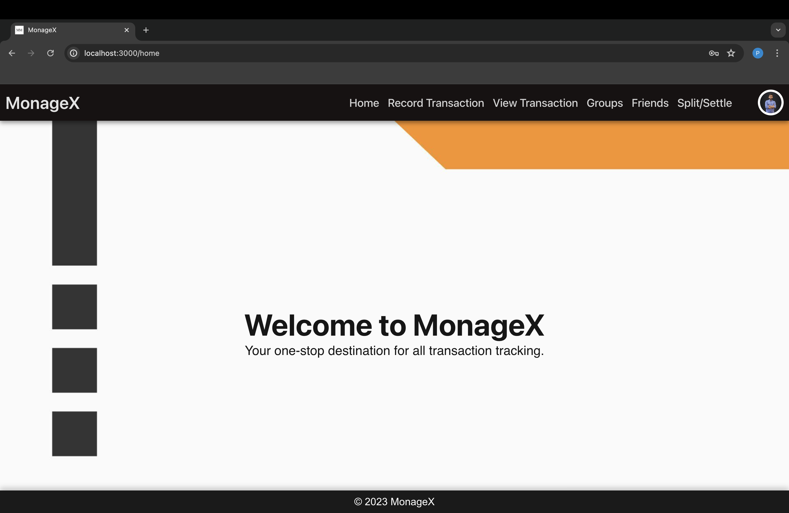
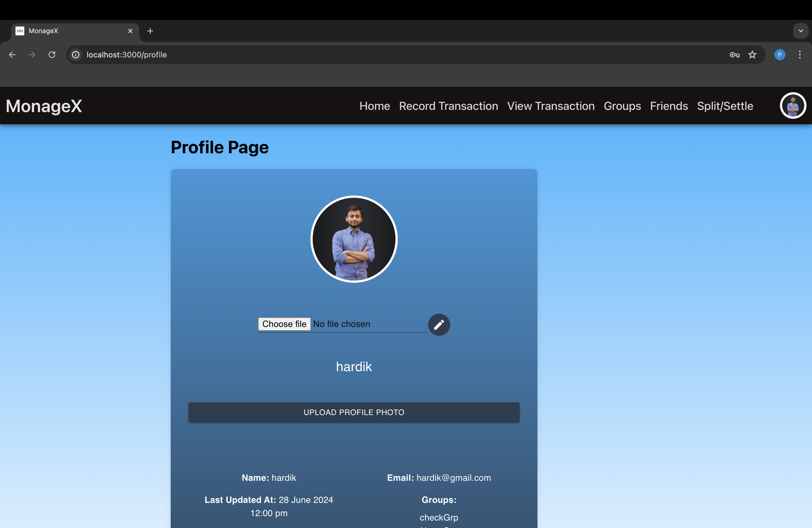
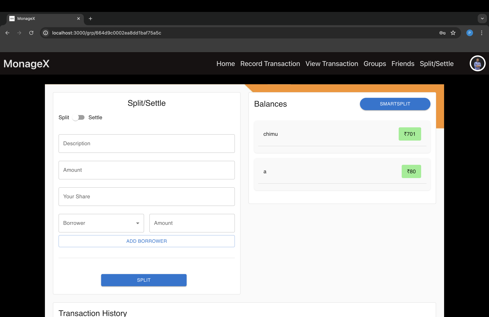
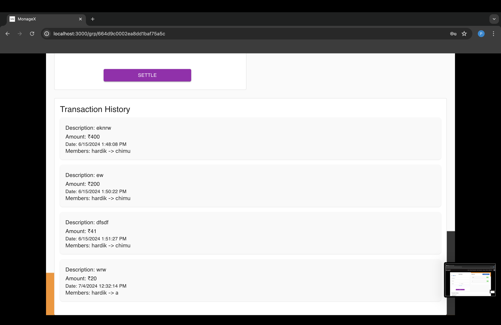
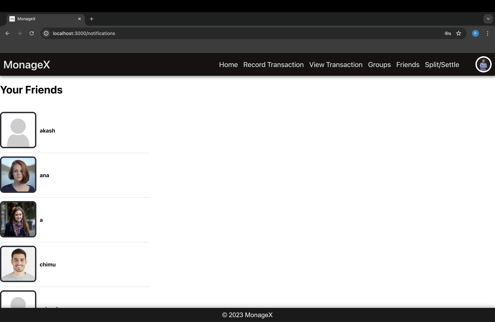
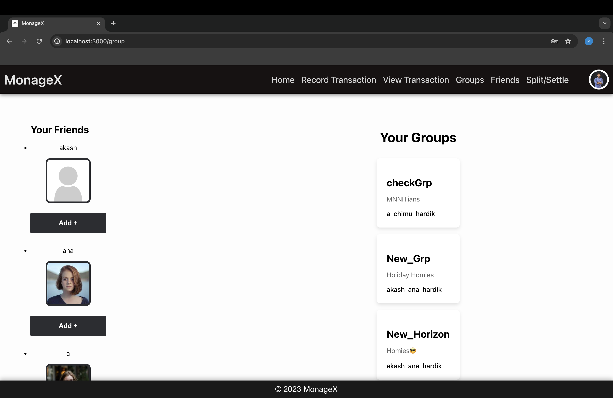

# Expense Tracker MERN App

## Table of Contents
- [Introduction](#introduction)
- [Features](#features)
- [System Architecture](#system-architecture)
- [Pages and Descriptions](#pages-and-descriptions)
- [Technologies Used](#technologies-used)
- [Screenshots](#screenshots)

## Introduction
The Expense Tracker MERN App is a comprehensive financial management tool designed to help users effectively manage their finances. Users can track their income, expenses, and transfers with ease, gaining insights through visual representations such as pie charts. The app facilitates seamless bill splitting among friends and enables users to settle debts effortlessly. Users can view detailed information about who owes them and whom they owe, enhancing transparency and simplifying financial interactions.

## Features
- **Expense Tracking**: Track your income, expenses, and transfers.
- **Pie Charts**: Visualize income, expenses, and transfers individually through pie charts.
- **Split and Settle**: Split bills with friends and settle debts easily. Notifications are sent to involved users via NodeMailer when a split or settle action is made.
- **Simplify Debts**: Manage and simplify debts, making it easy to keep track of who owes whom. This feature minimizes the number of transactions needed to settle debts, optimizing financial interactions.
- **Transaction History**: View a detailed history of all transactions, including splits and settlements.
- **Authentication**: Secure user authentication using JSON Web Tokens (JWT).
- **Friend Requests and Groups**: Connect with other users through friend requests and form groups to manage shared expenses.

## System Architecture
The Expense Tracker MERN App follows a client-server architecture:
- **Front-end**: Built with React, Redux, and Chart.js for dynamic and responsive user interfaces.
- **Back-end**: Developed using Node.js, Express.js, JWT, and NodeMailer for APIs, user authentication, expense tracking, and debt management.
- **Database**: MongoDB with Mongoose, a NoSQL database, stores user data, transaction details, and financial information.

## Pages and Descriptions
- **Sign Up / Login Page**: User authentication and registration.
- **Home Page**: Dashboard overview of financial status and quick access to key features.
- **Profile Page**: Manage user profile information and settings.
- **Recording Expenses Page**: Record income, expenses, and transfers with categorization options.
- **Expense Showing Page**: Display and analyze recorded expenses with pie charts.
- **Split/Settle Page**: Manage shared expenses, view who owes whom, settle debts, and review transaction history. Includes an option to simplify debts for streamlined financial management.
- **Friends Page**: Manage friend requests, connections, and view friends list.
- **Groups Page**: Create and manage groups for shared expenses, add members, and settle debts within groups.

## Technologies Used
- **Frontend**: React, Redux, Chart.js
- **Backend**: Node.js, Express.js, JWT, NodeMailer
- **Database**: MongoDB, Mongoose
- **Other Tools**: Axios, Bcrypt, dotenv

## Screenshots
Add screenshots of the app pages to provide visual context:

- **Sign Up / Login Page**
  
  

- **Home Page**
  

- **Profile Page**
  

- **Recording Expenses Page**
  

- **Expense Showing Page**
  
  

- **Split/Settle Page**
  
  

- **Friends Page**
  

- **Groups Page**
  
